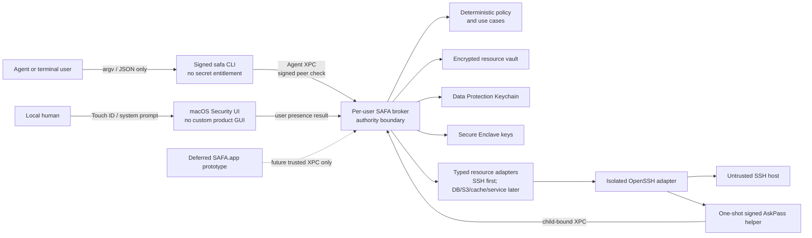

# SAFA Architecture

Status: **Accepted for pre-release development**  
Last reviewed: **2026-08-16**

This document is the implementation guide for SAFA. It defines the trust boundaries, module
responsibilities, source organization, CLI conventions, and delivery order. Feature specifications
describe behavior; this document decides where that behavior belongs and which component is trusted
to perform it.

## 1. Product goal and current priority

SAFA is a macOS-native security boundary that lets an Agent discover and operate registered
resources without receiving reusable credentials. Its core is a generic encrypted resource
directory; SSH hosts are the first executable profile, not the limit of the model. Database,
object-storage, cache, and service adapters can reuse the same alias, metadata, relationship,
credential-reference, authorization, and policy boundaries.

The immediate goal is functional parity with the existing local `ssh-hosts` workflow while moving
its sensitive operations behind native macOS controls. Persistent tamper-evident audit history is
useful, but it is deliberately later than:

1. importing and resolving existing SSH hosts and jump routes;
2. reliable public-key SSH and Core Tunnel preflight;
3. Keychain-backed sudo and service credentials;
4. broker-owned execution with human-friendly system approval;
5. safe operational workflows such as scoped sudo and atomic user creation.

Delivery is CLI-first. The existing `SAFA.app` target is retained as a deferred prototype and build
compatibility surface, but the parity phase adds no new window, menu-bar feature, dashboard, custom
approval UI, or SwiftUI workflow. System-provided Touch ID, Keychain, LocalAuthentication, and
Authorization Services prompts are security controls rather than product GUI. If a safe operation
cannot yet be completed through those controls, SAFA returns `user_action_required` instead of
accepting a secret or approval through the Agent-facing CLI.

Release and Skill-package publication remain frozen until the repository owner explicitly enables
them.

## 2. Architecture principles

1. **The CLI is a parser and presenter, not a security boundary.** It has no Keychain entitlement,
   cannot approve requests, and never launches credential-bearing processes.
2. **The broker owns authority.** It resolves encrypted resource metadata, enforces policy, obtains
   credentials, launches transports, and returns bounded results.
3. **macOS owns human presence.** During the CLI-first phase, privileged credential use and human
   confirmation rely on system-provided Keychain and LocalAuthentication interaction. The existing
   app is deferred; its authority never moves into the Agent-facing CLI.
4. **Use macOS primitives directly.** Prefer Data Protection Keychain, Secure Enclave,
   LocalAuthentication, signed XPC peers, and `SMAppService` over a custom password store or daemon
   installer.
5. **Use a functional core and imperative shell.** Domain validation, canonicalization, scope
   matching, and policy are deterministic. Keychain, XPC, files, clocks, processes, and UI are
   adapters behind narrow protocols.
6. **Typed boundaries over dictionaries.** Public CLI JSON and XPC payloads use versioned DTOs with
   explicit coding keys. Domain persistence models are not wire contracts.
7. **Fail closed without becoming hostile.** A rejection must contain a stable code and a safe next
   action; it must not silently fall back to raw SSH, password prompts, mutable SSH config, or weaker
   host verification.
8. **Claims follow evidence.** README capability claims require an executable contract or
   integration test.
9. **Profiles extend the directory; they do not fork it.** Resource kinds, access methods,
   credential roles, and metadata keys are validated namespaced identifiers. New adapters do not
   add arbitrary JSON to the vault or put credentials in metadata.

## 3. System context and trust boundaries



### Boundary rules

- Agent/CLI data may choose a resource alias and command, but cannot provide an endpoint,
  credential reference, approval decision, or trusted identity. `resource inspect` is the one
  read-only disclosure path: after a macOS-owned user-presence prompt, it may return non-secret
  connection and inventory metadata. It never returns a credential reference, Keychain locator,
  private/public key material, host fingerprint, password, or token.
- XPC listeners require the expected signing identifier, Developer Team, effective user, and audit
  session. The broker derives peer identity from the connection, not message fields.
- The Agent-facing CLI cannot submit a secret or approval. A system-authenticated local workflow may
  confirm a broker-computed request but cannot rewrite its target, command, or policy result.
- The deferred app target is not part of current feature delivery. If it is reactivated later, it
  retains a separate signing identity and trusted XPC contract.
- The broker writes a per-request SSH config and pinned `known_hosts`, disables ambient forwarding,
  and does not inherit the user's mutable SSH configuration during execution.
- Remote output is untrusted data. It is bounded before returning to the Agent and must never be
  interpreted as new instructions by the Skill.

## 4. Module map and dependency direction

The current SwiftPM target split is appropriate because several modules coincide with real trust or
test seams. The targets must remain one-way dependencies; not every target needs to be an externally
vended library product.

| Module | Owns | Must not own |
|---|---|---|
| `SAFADomain` | Generic resource directory, typed metadata, value types, invariants, state transitions | Keychain, XPC, files, process launch, CLI formatting |
| `SAFAProtocol` | Explicit versioned CLI/XPC DTOs and stable error codes | Vault models, policy logic, Security-framework helpers |
| `SAFACrypto` | Keychain, encrypted vault, Secure Enclave adapters | Resource workflows, SSH command construction |
| `SAFAPolicy` | Pure command classification and grant matching | UI, clocks without injection, credential access |
| `SAFATransport` | Bounded subprocess lifecycle and cancellation | SSH policy or credentials |
| `SAFASSH` | OpenSSH config, host identity, SSH-agent/AskPass and sudo transport adapters | Keychain lookup, approvals, resource persistence |
| `SAFABroker` | Application use cases, XPC adapters, orchestration/composition root | CLI parsing, product presentation |
| `SAFACLI` | ArgumentParser commands, typed request mapping, JSON/human presentation | Secrets, policy, direct SSH, approval |
| `SAFAAskPass` | One-shot child-bound credential response | Resource lookup or general Keychain queries |
| `SAFA.app` | Deferred prototype and future trusted local interaction host | New parity-phase GUI, remote execution, Agent-facing approval commands |

The intended dependency shape is:

```text
SAFACLI ───────────────► SAFAProtocol
SAFA.app ──────────────► SAFAProtocol
SAFABroker ────────────► SAFAProtocol + SAFADomain + SAFAPolicy + SAFACrypto + SAFASSH
SAFASSH ───────────────► SAFADomain + SAFATransport
SAFACrypto ────────────► SAFADomain
SAFAPolicy ────────────► SAFADomain
SAFATransport ─────────► SAFADomain
```

`SAFAProtocol` must gradually stop importing persistence-oriented domain aggregates. Map explicit
wire DTOs to domain types at the broker edge. This prevents a domain refactor from silently changing
the XPC or CLI schema.

## 5. Source organization

Organize files by responsibility inside each target. Do not return to target-wide `Models.swift`,
`SAFACommand.swift`, or `BrokerService.swift` monoliths.

```text
Sources/
├── SAFADomain/
│   ├── Resources/
│   ├── Execution/
│   ├── Credentials/
│   └── Authorization/
├── SAFAProtocol/
│   ├── Agent/
│   ├── TrustedApp/
│   ├── AskPass/
│   └── CLI/
├── SAFABroker/
│   ├── UseCases/
│   ├── XPC/
│   ├── Resources/
│   └── Runtime/
├── SAFACLI/
│   ├── Commands/Resource/
│   ├── Commands/Exec/
│   ├── Commands/Credential/
│   └── Presentation/
└── SAFASSH/
    ├── Configuration/
    ├── Authentication/
    ├── Tunnel/
    └── Sudo/
```

Guidelines:

- Prefer one primary type per file. A file over roughly 300 lines should have an explicit cohesion
  reason; otherwise split it before adding behavior.
- Command types parse arguments and call an injected client/use case. They do not scan dynamic JSON
  dictionaries or implement resource business rules.
- Broker XPC exports adapt bytes to typed operations. Use cases remain testable without an XPC
  connection.
- Mutable security state is actor-isolated. `@unchecked Sendable` is limited to small Foundation/XPC
  bridges with their synchronization visible in the same file.
- Composition happens only in the executable/app runtime roots. Do not create global service
  locators or singletons for credentials.

## 6. Swift CLI conventions

SAFA uses Apple's `swift-argument-parser` and follows these rules:

- The root and every asynchronous subtree use `AsyncParsableCommand`.
- Each command family is a separate file/directory with `CommandConfiguration`, `abstract`, argument
  help, and examples where the operation is non-obvious.
- Shared flags such as `--json`, timeouts, and output limits use `@OptionGroup`.
- Validated scalar arguments such as resource alias and state conform to
  `ExpressibleByArgument`; cross-field constraints use `validate()`.
- `run()` performs only: parse/validate → create typed request → call client → present response.
- Machine mode writes exactly one versioned JSON object to stdout. Human diagnostics go to stderr
  only when they cannot be represented safely in that object.
- Exit-code mapping is centralized and keyed by a stable error-code enum, not duplicated string
  switches.
- Version information comes from generated build metadata, never a literal repeated across CLI and
  Xcode settings.
- `--` remains the boundary before a remote argument vector. Shell programs are explicit and never
  inferred by concatenating arguments.

## 7. Human-friendly CLI-first flows

### Discover and inspect a resource

1. `safa resource list --json` and `resource show ALIAS --json` return a safe summary: canonical
   alias, resource type, state, health, capabilities, and only source-code-allowlisted metadata.
2. Unknown or newly imported metadata keys fail closed as private. A configuration file cannot mark
   its own field public.
3. `safa resource inspect ALIAS --json` asks macOS to verify the local user with Touch ID or login
   credentials. Denial and prompt-rate-limiting return no detail object.
4. An approved inspection may return alternate aliases, access methods, endpoint, username,
   security domain, non-secret typed metadata, relationships by alias, and identity status. It never
   returns secrets or credential/key locators.
5. Canonical and alternate aliases occupy one collision namespace and resolve to the same stable
   resource identity for inspection and execution.

### Resource directory extension model

- Types are open validated identifiers such as `host.linux`, `host.nas`, `database.mysql`,
  `database.postgresql`, `object-storage.s3`, `cache.redis`, and `service.http`.
- Access methods are independent identifiers such as `ssh`, `database.mysql`, `object-storage.s3`,
  `cache.redis`, and `http`. Supporting an identifier in storage does not claim its adapter is
  implemented.
- Metadata is an ordered set of typed key/value entries (`text`, `integer`, `boolean`, `byte_count`,
  or `text_list`). Passwords, API tokens, private keys, access keys, and Keychain locators are never
  metadata.
- Resource relationships such as `hosted-on`, `depends-on`, and `backed-by` form the later service
  topology without copying endpoints into dependent records.
- Credential kinds and roles are also extensible identifiers, while secret material stays in
  Keychain/Secure Enclave and the encrypted directory keeps only opaque references.

The normative schema and initial host keys are defined in
`specs/001-secure-agent-access/contracts/resource-directory-v1.md`.

### Import an existing SSH host

1. A local human selects an existing alias; the broker resolves it through a read-only
   `ssh -G <alias>` adapter without importing a private key or password value.
2. The CLI shows a sanitized route summary: route type, jump requirement, and tunnel health. Private
   endpoints remain inside the broker boundary.
3. The broker probes host keys and returns readable SHA-256 fingerprints. The human verifies one
   through a trusted channel and confirms it through system user presence; raw base64 entry is not a
   normal flow.
4. The user chooses an authentication mode:
   - existing macOS OpenSSH agent/`UseKeychain` identity for parity;
   - a new device-bound Secure Enclave key for managed hosts;
   - explicit legacy password onboarding when no key route exists.
5. The broker runs a non-destructive `hostname; id -un` verification and the CLI reports a bounded,
   non-secret result.

The execution-time route is snapshotted and host-pinned in the encrypted vault. SAFA does not blindly
trust later edits to `~/.ssh/config`.

### Add sudo capability

1. The Agent-facing CLI never requests or accepts a sudo password.
2. The CLI-first parity slice may import an existing per-host sudo credential from the current local
   Keychain only inside a broker-owned, system-authenticated migration flow.
3. New sudo-password enrollment remains unavailable until a safe local secret-entry path exists; it
   must not be improvised through argv, environment variables, chat, or Agent-controlled stdin.
4. The broker stores sudo as a separate `ThisDeviceOnly` Keychain item and verifies it with a
   read-only `sudo -v` operation.
5. Sudo remains independently removable and high-privilege use requires system user presence.

### Agent execution

```text
safa host list --json
safa host check hm-106 --json
safa exec hm-106 --json -- systemctl status docker
```

The Agent sees aliases, capabilities, health, stable errors, and bounded output. If Core Tunnel is
down, the response directs the user to start it instead of asking for an IP or password.

## 8. `ssh-hosts` parity plan

| Existing workflow capability | Current SAFA state | Native target state | Priority |
|---|---|---|---|
| Business-name/alias resolution | Canonical and alternate alias resolution implemented | Search and import UX over the encrypted directory | P0 |
| `ssh -G` route inspection | Missing | Trusted-app import adapter with reviewed snapshot | P0 |
| Core Tunnel listener preflight | Missing | Route-health adapter and actionable `tunnel_unavailable` result | P0 |
| Public-key `BatchMode=yes` SSH | Not wired end-to-end | Existing OpenSSH identity plus managed Secure Enclave identity | P0 |
| Strict host-key checking | Implemented, manual UX | Fingerprint probe/confirmation and rotation flow | P0 |
| Read-only diagnosis | Narrow allowlist exists | Argument-aware policy that excludes secret-dumping forms | P0 |
| Per-host sudo in Keychain | Model only | Separate credential, system approval, protected stdin | P1 |
| One scoped sudo command | Missing | Broker-owned sudo adapter and exact approval | P1 |
| Atomic user creation | Missing | Reviewed operational recipe over scoped sudo | P1 |
| Service credential status/injection | Generic resource/credential schema implemented; adapters missing | Typed service profiles and least-privilege client adapters | P2 |
| Credential discovery/import | External Python tooling | Explicit local migration assistant; never background scanning | P2 |
| Core Tunnel inventory refresh | External Python tooling | Read-only optional import adapter | P2 |
| Persistent tamper-evident audit UI | In-memory event sketch | Deferred until core operations are useful and safe | Later |

## 9. macOS security controls

- **Keychain:** use the Data Protection Keychain and the most restrictive accessibility compatible
  with broker operation. Device-bound values use a `ThisDeviceOnly` class.
- **User presence:** privileged credentials and authorization decisions use
  `SecAccessControl`/LocalAuthentication. A CLI flag or stdin confirmation is never approval.
- **Secure Enclave:** private key material is generated and used on-device. Do not claim managed
  Secure Enclave SSH until the constrained SSH-agent socket protocol is implemented and tested
  end-to-end.
- **XPC:** both sides set peer code-signing requirements; the listener also validates user and audit
  session. Agent, broker, AskPass, and any future trusted local-interaction process use role-specific
  signing identifiers.
- **Service lifecycle:** register the per-user broker through `SMAppService`; show registration state
  and a direct System Settings remediation path.
- **Files:** application-support directories are `0700`; vault/config/known-host files are `0600`;
  temporary request directories are removed after execution.

## 10. Delivery gates

No new authorization or audit feature starts until the architecture remediation gate is green:

1. split the four current monolith files by feature/responsibility;
2. replace dynamic broker reply maps for touched operations with typed DTOs;
3. correct advertised capabilities and README claims;
4. remove secret-dumping command forms from the automatic diagnostic policy;
5. add SSH-config import, tunnel preflight, and public-key execution contract tests;
6. validate the signed broker/CLI/AskPass boundaries and keep the deferred app target buildable
   without adding GUI work or publishing artifacts.

After every slice: format, build, test, unsigned Xcode assembly, Draft PR, CI, squash merge. No tag,
GitHub Release, notarized artifact, or Skill package is created while the publication hold is active.

## References

- [Swift Package Manager: Introducing Packages](https://docs.swift.org/swiftpm/documentation/packagemanagerdocs/introducingpackages/)
- [Apple Swift Argument Parser](https://github.com/apple/swift-argument-parser)
- [Apple Keychain Services](https://developer.apple.com/documentation/security/keychain-services)
- [Accessing Keychain items with Touch ID](https://developer.apple.com/documentation/localauthentication/accessing-keychain-items-with-face-id-or-touch-id)
- [Protecting keys with the Secure Enclave](https://developer.apple.com/documentation/security/protecting-keys-with-the-secure-enclave)
- [SMAppService](https://developer.apple.com/documentation/servicemanagement/smappservice)
- [XPC peer requirements](https://developer.apple.com/documentation/xpc/xpcpeerrequirement)
