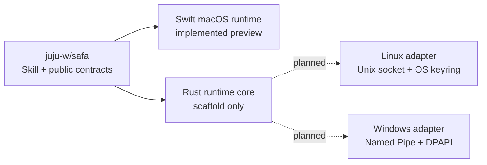

<p align="center">
  
</p>

# SAFA Runtime

Native security runtimes for [SAFA](https://github.com/juju-w/safa). This repository implements the
trusted local boundary that owns credentials, user authorization, connection policy, and bounded
execution. The current working implementation is Swift on macOS; a deliberately non-shipping Rust
workspace establishes the Linux/Windows implementation boundary without claiming those platforms
are supported.

[](https://github.com/juju-w/safa-runtime/actions/workflows/ci.yml)
[](https://github.com/juju-w/safa-runtime/stargazers)
[](LICENSE)


## Repository boundary



The Swift package remains at the repository root to avoid a high-risk mechanical relocation while
the macOS MVP is stabilizing. Rust work lives under `Platforms/Rust/`. Both implementations must
consume the canonical public contract from `juju-w/safa`; neither may create a platform-specific
Agent command surface.

> [!IMPORTANT]
> SAFA is currently an early diagnostic MVP, not a production release. The bounded read-only path is
> implemented; arbitrary commands, sudo approval, persistent audit storage, notarized distribution
> and the final globally installable Skill are still roadmap items.

## Stop pasting infrastructure secrets into chat

Imagine a service alert arrives:

> **You:** Find out why `report.prod` is alerting and whether the service is unhealthy.

Without a local access boundary, the conversation often becomes:

> **Agent:** What is the machine's IP and SSH port? Which username and password should I use? This
> check may need sudo—please send the sudo password too.

That puts infrastructure inventory and reusable credentials into chat history, process context, logs
or model-visible tools.

With SAFA, a system-authenticated CLI flow can import `report.prod` from an existing logical
OpenSSH config alias without putting its endpoint or username in Agent-visible input. The import is
stored as a `needs_setup` draft; SAFA does not pretend that SSH configuration proves a trusted host
identity or supplies a credential. A separate macOS-authenticated `resource setup` can activate a
direct route only when the host already exists in `known_hosts` and an existing OpenSSH identity or
agent succeeds. Once setup completes, the Agent receives only the safe alias and invokes the signed CLI:

```bash
safa exec report.prod --json \
  --intent "Check why the report service is alerting" -- \
  systemctl is-active report-api
```

The Agent can inspect the bounded, redacted result but cannot retrieve the plaintext password.
Protected inventory—including an endpoint—requires an explicit `resource inspect` operation and a
macOS user-presence prompt. If SAFA is unavailable or the host key changes, it fails closed instead
of asking the user for a credential or falling back to raw SSH.

## What SAFA protects

- **Extensible private resource directory** — hosts, databases, object stores, caches, and services
  share typed aliases, metadata, relationships, and opaque credential references. Hosts, ports,
  usernames and routes live in an authenticated encrypted vault rather than in Agent prompts.
- **Two-level discovery** — list/show exposes only source-code-allowlisted summary metadata;
  protected inspect requires a macOS Touch ID/login prompt and still never returns credentials or
  key material.
- **macOS-backed credentials** — passwords use the data-protection Keychain; device-bound P-256 key
  primitives use Secure Enclave where supported.
- **Signed local boundary** — the per-user broker, CLI and AskPass helper authenticate peers by code
  signature, Developer Team, effective user and audit session.
- **Strict remote identity** — every SSH execution uses an isolated configuration and a pinned host
  key. Changed identity is a hard failure.
- **One-shot password delivery** — AskPass credentials are bound to the exact launched SSH child PID,
  expire quickly and can be consumed only once.
- **Bounded evidence** — execution has time and output limits, preserves the remote exit code and
  redacts matching credential bytes before returning data to the Agent.
- **Audit events** — the MVP emits sanitized request, decision and execution events. Persistent,
  tamper-evident audit history and review UI are planned for the authorization phase.

## Permissions and blast radius

SAFA is designed to complement server and database permissions, not replace them. A practical
deployment should register separate resource aliases and least-privilege remote accounts for each
security domain—for example, a read-only reporting account must not share credentials with a database
administrator or production deployment account.

The current MVP isolates each resource credential and permits only a small diagnostic allowlist.
Fine-grained command scopes, database-role-aware workflows, Touch ID approval, sudo injection,
time-limited grants and immediate revocation are specified for the next authorization phase.

Development is CLI-first and the current product has no custom GUI. macOS system Touch ID, Keychain,
LocalAuthentication and Authorization Services prompts remain part of the security boundary.
Resource add/edit/setup/disable/enable/remove operations require macOS user presence. Add/edit
resolve only a logical `Host` alias through the broker's read-only `ssh -G` adapter; endpoint,
username, password, private-key path, sudo password and token flags do not exist. This first import
adapter accepts only `host.linux`, `host.macos`, and `host.nas`; later database/S3/cache adapters
remain separate work.

## Current diagnostic MVP

Implemented now:

- safe resource discovery by logical alias;
- system-authenticated `resource add/edit/setup/disable/enable/remove`, with SSH-config imports entering
  `draft/needs_setup`, direct existing OpenSSH routes activating only after pinned-host verification,
  and trusted-resource retargeting rejected;
- encrypted inventory and Keychain password storage;
- strict pinned-host SSH configuration;
- argument-constrained diagnostics such as `systemctl is-active`, fixed-field process/container
  metrics, `df`, `free` and `uptime`; secret-dumping variants are rejected;
- child-bound one-shot AskPass, output redaction and sanitized audit emission;
- signed, idempotent per-user broker activation through macOS `SMAppService`, packaged in a
  GUI-less app container with no custom product UI;
- fail-closed unsigned runtime, peer, host-identity, timeout and unsupported-command behavior;
- synthetic contract, integration and security tests that contact no real server.

Not yet shipped:

- arbitrary shell commands, remote mutations, sudo and execution approval;
- password/Secure Enclave credential enrollment, first-use host confirmation, and
  `ProxyJump`/`ProxyCommand` route snapshotting;
- persistent audit verification, recovery and credential-reuse warnings;
- complete Secure Enclave public-key onboarding through the SSH agent channel;
- signed/notarized universal runtime artifacts and an installable global Skill package.

## Build and validate

The unsigned build validates assembly only. Runtime XPC, Keychain and ServiceManagement behavior
requires the native components to be signed by the same configured Apple Developer Team.

```bash
xcrun swift-format lint --recursive --strict \
  Sources Tests Apps/SAFA/Targets Package.swift
swift test
swift build -c release
xcodebuild -quiet -project Apps/SAFA/SAFA.xcodeproj -scheme "SAFA Runtime" \
  -configuration Debug CODE_SIGNING_ALLOWED=NO build
```

See the [diagnostic MVP quickstart](specs/001-secure-agent-access/quickstart.md) for the synthetic
journey and signed development setup.

## Runtime roadmap

Skill and manifest distribution is owned by [`juju-w/safa`](https://github.com/juju-w/safa). This
repository produces native runtime assets only after platform security and conformance gates pass.

1. Stabilize and sign the Swift macOS runtime.
2. Import shared conformance fixtures from the product contract repository.
3. Implement the Linux credential, peer-identity, user-authorization, and service-lifecycle adapters
   in Rust before adding a distributable Rust CLI or daemon.
4. Add Windows only after the same boundary is expressed through Credential Manager/DPAPI and Named
   Pipe access control.
5. Submit exact asset metadata and checksums to the product repository by reviewed manifest PR.

## Design and specification

The owl guardian is SAFA's visual shorthand for a local, watchful security boundary. Canonical Skill
and brand packaging now live in `juju-w/safa`; the assets retained here support native runtime
documentation and application packaging.

- [Normative architecture and SSH parity plan](ARCHITECTURE.md)
- [Initial code architecture audit](docs/architecture/reviews/2026-08-16-initial-code-audit.md)
- [Project Swift development Skill](.agents/skills/develop-swift/SKILL.md)
- [Project macOS CLI development Skill](.agents/skills/build-macos-cli/SKILL.md)
- [Project constitution](.specify/memory/constitution.md)
- [Feature specification](specs/001-secure-agent-access/spec.md)
- [Implementation plan](specs/001-secure-agent-access/plan.md)
- [Task breakdown](specs/001-secure-agent-access/tasks.md)
- [CLI contract](specs/001-secure-agent-access/contracts/cli-v1.md)

SAFA is licensed under the [MIT License](LICENSE).
