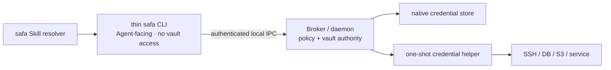

# SAFA Runtime

Native security runtimes for [SAFA](https://github.com/juju-w/safa). This repository implements the
trusted local boundary that owns resource metadata, credential use, user authorization, policy,
remote transport, and bounded output.

[](https://github.com/juju-w/safa-runtime/actions/workflows/ci.yml)
[](https://github.com/juju-w/safa-runtime/actions/workflows/rust.yml)
[](LICENSE)

> [!IMPORTANT]
> The Swift/macOS diagnostic Runtime is an implementation preview. No signed/notarized public
> Runtime package, tag, GitHub Release, or Skill package has been published. The Rust workspace
> contains a non-shipping, fail-closed CLI contract shell; it is not Linux or Windows support and
> does not replace the working Swift/macOS CLI.

## One Runtime package, isolated internal authority

Each supported platform will produce one Runtime package. One package does not mean one process:



On macOS the single `SAFA.app` package contains the `safa` CLI, `safa-broker`, and
`safa-askpass`. Process separation ensures a modified Agent workflow or CLI cannot inherit Keychain
authority. The Broker resolves protected resource data itself, enforces policy, and never exposes a
raw-secret operation.

Local IPC does not carry plaintext credentials. Kernel-mediated peer identity, native code identity,
Broker-side authorization, request binding, and native user presence are the relevant controls;
inventing another encryption layer between compromised endpoints would not replace them.

## Why open source does not reveal the vault

The security model assumes an attacker can read every line of source. Developer signing keys, vault
keys, and user credentials are not in the repository.

- macOS Broker connections validate the expected role, signing identifier, Developer Team, effective
  user, and audit session.
- A modified binary loses the official signature and cannot become the official Broker's trusted
  client.
- Calling the official CLI still provides only Broker-approved operations; it cannot return stored
  credentials.
- Keychain access remains in the Broker target, never the Agent-facing CLI.
- Complete compromise of the local administrator/root account is outside the guarantee of a purely
  local vault; Secure Enclave, least-privilege remote accounts, revocation, and audit reduce impact
  but do not make that compromise impossible.

Linux requires an additional design gate: a Unix socket and `SO_PEERCRED` identify a user, but not an
official executable among malicious processes already running as that user. The future Linux adapter
must pair Broker policy with a reviewed native authorization mechanism for protected operations.

## Repository layout

```text
Package.swift, Sources/, Apps/, Tests/
    Swift/macOS Runtime implementation and security tests

Platforms/Rust/
    Non-shipping Rust CLI contract shell, platform-neutral core, and future adapters

specs/001-secure-agent-access/
    Runtime implementation history, threat decisions, and macOS development journey
```

The Agent Skill, public CLI/resource contracts, runtime resolver, exact release manifests, product
story, and distribution documentation are canonical in
[`juju-w/safa`](https://github.com/juju-w/safa). This repository must not grow a second Skill or a
platform-specific Agent contract.

## macOS development

The unsigned build validates assembly only. Runtime XPC, Keychain, LocalAuthentication, code-identity,
and `SMAppService` behavior require every native component to be signed by the same configured Apple
Developer Team.

```bash
xcrun swift-format lint --recursive --strict \
  Sources Tests Apps/SAFA/Targets Package.swift
swift test --parallel
swift build -c release
xcodebuild -quiet -project Apps/SAFA/SAFA.xcodeproj -scheme "SAFA Runtime" \
  -configuration Debug CODE_SIGNING_ALLOWED=NO build
```

For a signed development journey, see
[`specs/001-secure-agent-access/quickstart.md`](specs/001-secure-agent-access/quickstart.md).

## Rust boundary validation

```bash
cd Platforms/Rust
cargo fmt --check
cargo clippy --workspace --all-targets -- -D warnings
cargo test --workspace
```

The Rust `safa` executable currently implements only local `version`, fail-closed `doctor`, stable
JSON envelopes, and invocation errors. It consumes a pinned copy of the canonical product fixture.
It has no Broker client, credential access, authorization, daemon, or remote transport and is not
assembled into `SAFA.app`. Protected commands remain on the Swift/macOS Runtime until a native
Broker client and the full platform gates are complete.

## Architecture and contribution rules

- [Runtime architecture](ARCHITECTURE.md)
- [Initial Swift architecture audit](docs/architecture/reviews/2026-08-16-initial-code-audit.md)
- [Swift development instructions](.agents/skills/develop-swift/SKILL.md)
- [macOS CLI/runtime instructions](.agents/skills/build-macos-cli/SKILL.md)
- [Repository contribution rules](AGENTS.md)

SAFA Runtime is licensed under the [MIT License](LICENSE).
