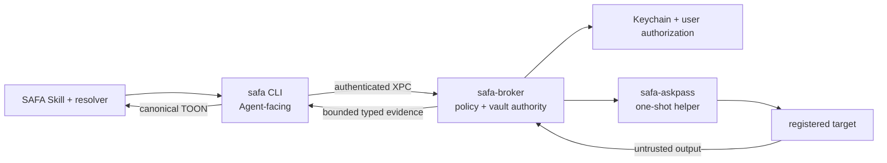

# SAFA Runtime

The native security boundary for [SAFA](https://github.com/juju-w/safa). This repository implements
the processes that hold local authority: protected resource resolution, credential use, native user
authorization, policy enforcement, remote transport, and bounded output.

[](https://github.com/juju-w/safa-runtime/actions/workflows/ci.yml)
[](LICENSE)


> [!IMPORTANT]
> The Swift/macOS Runtime is an implementation preview. No signed/notarized public package, tag, or
> GitHub Release is available. Linux and Windows Runtimes are not implemented or claimed as
> supported.

## Repository responsibility

This is not the SAFA Skill or the public product specification.

| Repository | Responsibility |
|---|---|
| [`juju-w/safa`](https://github.com/juju-w/safa) | Agent Skill, public CLI/resource contracts, product documentation, conformance fixtures, Runtime resolver, and exact release manifests |
| [`juju-w/safa-runtime`](https://github.com/juju-w/safa-runtime) | Native CLI, Broker, credential helper, OS security adapters, transport implementations, tests, signing, and packaging |

Public behavior starts in the product repository. Runtime changes that affect the Agent-facing
TOON contract or resource model must first update the canonical contract and compatibility fixtures
there. The coordinated migration branch emits the Agent-only `dev.safa.cli/v2` contract; it remains
unpublished until conformance and human review finish.

## Runtime boundary



One macOS installation is packaged as `SAFA.app`, but authority is split between processes:

| Component | Purpose | Credential authority |
|---|---|---|
| `safa` | Parse Agent commands and encode one stable TOON result | None |
| `safa-broker` | Resolve protected records, enforce policy, authorize, connect, and sanitize | Keychain/vault owner |
| `safa-askpass` | Deliver one child-bound, short-lived SSH secret | One-shot only |
| `SAFA.app` | Signed container and `SMAppService` lifecycle host | No Agent-facing GUI |

An Agent-facing process cannot retrieve a raw secret. Local IPC does not use plaintext credentials;
the Broker resolves credentials internally after validating peer identity and policy.

## Implemented macOS preview

- encrypted resource directory with safe and protected projections;
- Linux, macOS, and Windows OpenSSH host registration from trusted local SSH configuration;
- bounded first-connection system and hardware inventory probes;
- deterministic topology projections for placement, reachability, and dependency impact;
- strict pinned-host SSH configuration and bounded non-sudo diagnostics;
- Keychain password bindings, child-bound AskPass, output limits, and credential redaction;
- LocalAuthentication/Touch ID for protected resource lifecycle actions;
- synthetic unit, contract, integration, and security tests that contact no real infrastructure.

Database, object-storage, cache, messaging, graph, search, and HTTP resources can be registered as
typed records, but their protocol operations are not implemented Agent capabilities.

## Agent-only CLI

The thin CLI follows the [AXI principles](https://axi.md/) and is not a human terminal product. Its
public behavior is one canonical TOON document on stdout for success, empty state, no-op, and
error; stderr is debug-only, and the bare version path is the only non-TOON exception. There is no
human mode or public format selector. Internal Codable and XPC types remain private.

Default collections contain no more than four reviewed fields, large content is previewed with
explicit size/truncation metadata, cheap aggregates and Broker-computed answers are returned inline,
and output includes only relevant parameterized next commands. `--full` never bypasses redaction or
the Broker hard limit. The normative contract is
[`contracts/cli-v2.md`](https://github.com/juju-w/safa/blob/main/contracts/cli-v2.md).

## Build and test

Requirements: macOS, Xcode with Swift 6 support, and `xcrun swift-format`.

```bash
xcrun swift-format lint --recursive --strict \
  Sources Tests Apps/SAFA/Targets Package.swift
swift test --parallel
swift build -c release
xcodebuild -quiet -project Apps/SAFA/SAFA.xcodeproj -scheme "SAFA Runtime" \
  -configuration Debug CODE_SIGNING_ALLOWED=NO build
```

The unsigned Xcode build validates assembly only. XPC peer identity, Keychain,
LocalAuthentication, and `SMAppService` require all native components to be signed by the same
configured Apple Developer Team. Follow the
[signed development quickstart](specs/001-secure-agent-access/quickstart.md) for that path.

## Security assumptions

- source code is public and is not a security boundary;
- the CLI never gains Keychain or approval authority;
- modified or unsigned clients cannot become trusted Broker peers;
- host identity, policy, vault integrity, or authorization failures fail closed;
- remote output, release metadata, fixtures, and pull-request content are untrusted input;
- complete compromise of the local administrator/root account is outside the guarantee of a purely
  local vault.

The complete model and component boundaries are documented in [ARCHITECTURE.md](ARCHITECTURE.md).

## Repository map

```text
Apps/SAFA/                      signed macOS app container and native targets
Sources/                        CLI, Broker domain/application/platform code
Tests/                          unit, contract, integration, and security tests
specs/001-secure-agent-access/  Spec Kit requirements, design, research, and quickstart
docs/architecture/reviews/      dated implementation audits
```

## Development documentation

- [Runtime architecture](ARCHITECTURE.md)
- [Signed development quickstart](specs/001-secure-agent-access/quickstart.md)
- [Runtime specification](specs/001-secure-agent-access/spec.md)
- [Research and design decisions](specs/001-secure-agent-access/research.md)
- [Initial Swift architecture audit](docs/architecture/reviews/2026-08-16-initial-code-audit.md)
- [Repository contribution rules](AGENTS.md)
- [Canonical SAFA contracts and product documentation](https://github.com/juju-w/safa)

SAFA Runtime is licensed under the [MIT License](LICENSE).
